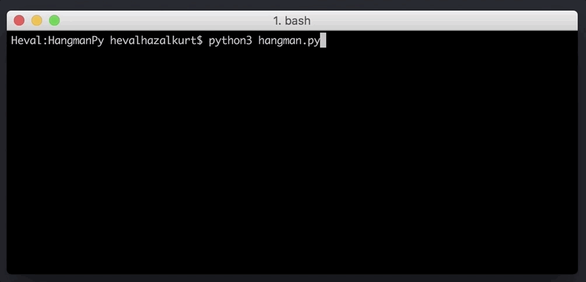

# HangmanPy
In this little project I developed a classic game called hangman in Python.

The game has two version :
1. **Hangman** : `hangman.py` - This version getting the word from local `.txt` The words in the `words.txt` document were taken from a database of 5000 words, which are the most commonly used in English, and the words such as the adverbs, prepositions, and conjunctions were eliminated.  

2. **Hangman Pro** : `hangmanpro.py` - This version getting the word from [WordsAPI](https://www.wordsapi.com/) randomly and little bit more hard to solve. To use that version you need to subscribe [WordsAPI](https://www.wordsapi.com/) and replace your API key into `'x-rapidapi-key': "YOUR_API_KEY"` section. The API isn't completely free but gives 2,500 requests per day in its free plan.

You can play the local version of game online on [Repl.it](https://repl.it/@hevalhazalkurt/HangmanPy).

It's just for fun so have fun! :)
